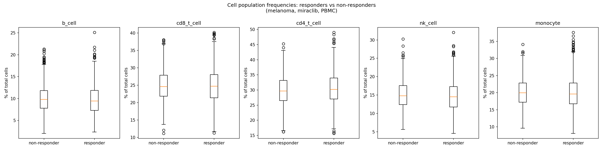

# Teiko Technical Assessment: Immune Cell Population Analysis

This is my solution for Bob Loblaw's clinical trial data (`cell-count.csv`). It loads the data into SQLite, answers his three questions (cell frequencies, responder vs non-responder comparison, baseline subset breakdown), and wraps it all in a Streamlit dashboard.

## Running it

```bash
make setup      # creates a venv and installs dependencies
make pipeline   # builds cell_counts.db and regenerates everything in output/
make dashboard  # launches the Streamlit dashboard
```

That's it, no arguments, no manual steps. This is exactly what I expect the Codespaces grader to run.

A couple of notes on `make setup`: it creates a local `.venv/` and installs into that rather than touching the system Python, using `uv` if it's available and falling back to plain `venv` + `pip` otherwise. I hit the "externally managed environment" error while testing this on my own Homebrew Python, which is exactly the kind of thing this avoids. Every subsequent target (`pipeline`, `dashboard`) runs through `.venv/bin/python`, so it behaves the same on my machine, in Codespaces, or anywhere else.

`cell_counts.db` is committed to the repo; I'm not gitignoring it. It's a generated file, but committing it means the dashboard works the moment you clone the repo, without needing `make pipeline` to have run first. That matters for deploying to something like Streamlit Community Cloud, which only clones the repo and installs dependencies and won't run my Makefile for me.

## Database schema

I went with three tables instead of mirroring the CSV directly:

```sql
subjects(subject_id PK, project, condition, age, sex, treatment, response)
samples(sample_id PK, subject_id FK, sample_type, time_from_treatment_start)
cell_counts(sample_id FK, population, count)   -- PK (sample_id, population)
```

**Why split subjects out?** In the raw CSV, a subject's project, condition, age, sex, treatment, and response are repeated on every one of their sample rows. I checked, and there are zero subjects with inconsistent values across samples, meaning those fields genuinely belong to the subject, not the sample. Keeping them denormalized would mean updating N rows every time you correct one subject's age, and it just wastes space once you're at scale. Splitting subjects into its own table fixes that.

**Why a long `cell_counts` table instead of five columns (b_cell, cd8_t_cell, ...)?** Every question Bob asks, frequencies, responder comparisons, whatever comes next, is naturally a "group by sample, filter by population" query. That's much more natural against rows than against five named columns. It also means if Bob's lab starts tracking a sixth population next quarter, that's just new rows being inserted, not a schema migration.

**How this holds up at scale (hundreds of projects, thousands of samples, more analytics types):** the shape of the schema doesn't need to change, it just gets bigger, and indexes keep it fast. I've already added indexes on `samples.subject_id`, `cell_counts.sample_id`, and `subjects(project, condition, treatment)`, since those are the columns everything filters and joins on. New analytics, time-series per population, cross-project comparisons, whatever Bob's colleagues want next, are new queries against these same three tables, not new tables or columns. If this ever needed to move beyond SQLite (concurrent writers, much bigger data), the schema ports to Postgres unchanged.

## Code structure

- **`load_data.py`**: builds the database from the CSV. Stdlib only (`sqlite3`, `csv`), no arguments, drops and recreates `cell_counts.db` each time it's run.
- **`analysis.py`**: all the actual analysis: computing frequencies, the responder comparison and its statistics, the baseline subset and its breakdowns. These are plain functions that take a database connection and return a DataFrame. Both the CLI (`python analysis.py`, which `make pipeline` calls to regenerate `output/`) and the dashboard import the exact same functions, so there's one source of truth for the logic and no risk of the dashboard drifting from the batch output.
- **`dashboard.py`**: the Streamlit app. It queries `cell_counts.db` live rather than reading the static files in `output/`, so it always reflects whatever's currently in the database.

I kept this as three flat scripts instead of a proper package. The assignment specifically wants `load_data.py` runnable directly at the repo root with no `-m` or arguments, and grading only ever goes through the three Makefile targets, so a `src/` layout would just be indirection with nothing to show for it here.

## The statistical method (Part 3)

For each of the five populations, restricted to melanoma + miraclib + PBMC samples, I compare responder vs non-responder relative frequencies with a two-sided Mann-Whitney U test. I chose that over a t-test because it doesn't assume the percentages are normally distributed, which felt like the safer assumption here. Populations with p < 0.05 get flagged as significant. Results and the boxplots land in `output/stats_summary.csv` and `output/boxplots_responder_vs_nonresponder.png`, and the same thing is live in the dashboard's Responder Analysis tab, where you can also adjust the cohort filters and the significance threshold instead of being stuck with my defaults.



Of the five, `cd4_t_cell` comes back significant (p < 0.05); the rest don't clear that bar.

## What's in `output/`

- `frequencies.csv`: the Part 2 table (sample, total_count, population, count, percentage)
- `stats_summary.csv` and `boxplots_responder_vs_nonresponder.png`: the Part 3 results
- `baseline_subset.csv` and `baseline_breakdown.csv`: the Part 4 filtered samples and their project/response/sex breakdowns

All of it gets regenerated by `make pipeline`.

## Dashboard

Three tabs, Frequencies, Responder Analysis, and Baseline Subset, each with live filters (project, condition, treatment, sample type, time point) and interactive Plotly charts, so you're not limited to the exact cohorts I hardcoded for Parts 2-4.

**Link:** [Immune Cell Population Dashboard on Streamlit](https://ag-teiko-technical-assessment.streamlit.app/)
